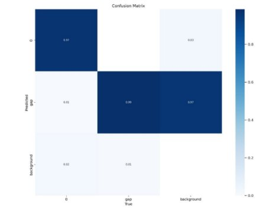

# On-Shelf Availability Detection using Machine Learning,Object Detection model YOLO

**Google Colab Link:** https://colab.research.google.com/drive/1YwgYQFAaVvJ7VPZTcSktccmtWakLgPQF?usp=sharing 
 
**Prefered Runtime Type:**
 
**Runtime Type:** Python3  
**Hardware Accelerator:** T4 GPU

## **Abstract**

In the dynamic ecosystem of retail operations, maintaining optimal On-Shelf Availability (OSA) is pivotal for ensuring customer satisfaction and long-term profitability. Out-of-Stock (OOS) instances not only inconvenience customers but also impact a retailer's competitiveness. Traditional approaches to OSA management have faced challenges in accuracy and scalability, leading to a paradigm shift towards leveraging deep learning models like YOLO (You Only Look Once) variants and Convolutional Neural Networks (CNN) to detect empty shelf spaces in real-time. However, the success of these models relies heavily on the availability of high-quality data, a persistent challenge in the retail landscape.

This research introduces a novel semi-supervised learning approach, amalgamating 'semi-supervised learning' and 'on-shelf availability' (SOSA), coupled with the YOLO architecture. Significantly reducing human effort for data annotations and model computation time, this approach focuses on efficient empty-shelf detection, akin to identifying clear lanes for an AI-based self-driving solution. It not only aims to streamline shelf management but also presents the first demonstration of explainable artificial intelligence (XAI) in the context of OSA, emphasizing transparency and adaptability in AI applications.

The experimental results showcase the superiority of the SOSA approach in accurately detecting empty and nearly empty shelves, potentially reshaping inventory management paradigms for retailers. This research endeavours to offer a cost-effective, time-efficient system that intelligently predicts product restocking needs, thereby optimizing business profits and augmenting customer satisfaction. By implementing a Vision-Based Intelligent Shelf-Management System, this study aims to empower retailers with real-time insights into shelf status, OSA, and future sales projections, revolutionizing decision-making in retail environments while considering the intricacies of the industry. Employing state-of-the-art object detection models optimized for real-time performance on diverse computing devices, our model achieves impressive processing capabilities, offering practical solutions for efficient retail operations.

This research delves into the intricate balance between model complexity, size, latency, and accuracy, paving the way for a more data-driven and advanced approach to shelf management in retail, ultimately contributing to the enhancement of the overall shopping experience and business profitability.

## **1. Introduction**

Within the complex realm of retail operations lies a delicate dance between strategy and logistics. The primary aim is, ensuring that customers effortlessly discover desired products thoughtfully placed within store shelves. This intricate process's efficiency isn't just about present shopping experiences; it shapes future product demand. On-Shelf Availability (OSA) shown in Figure 1 is the pivotal determinant of product accessibility, directly steering sales and profitability. However, this delicate balance often gets disrupted by the recurring plague of Out-of-Stock (OOS) situations, leaving customers frustrated and intensifying competition among retailers. [[2](#_ref152448539)]

Figure 1: On-Shelf Availability

### **1.1 Revolutionizing OSA Management with SOSA**

Traditionally, OSA management relied on manual stock checks and RFID (Radio Frequency Identification) sensors, methods prone to inaccuracies and scalability issues. [[21](#_ref152448763)] But the winds of change have ushered in a new era, steering towards harnessing the prowess of deep learning techniques to combat OOS woes. Enter the spotlight – a revolutionary approach termed SOSA, a fusion of 'semi-supervised learning' and 'on-shelf availability,' promising a more accurate and efficient solution. Notably, it pioneers the incorporation of explainable artificial intelligence (XAI) into OSA, emphasizing transparency and adaptability in AI applications. [[22](#_ref152449056)]

The novelty of this study lies in the fusion of 'semi-supervised learning' and 'SOSA,' employing the YOLO architecture and conducting a comparative analysis of three deep learning approaches. The experimental revelations shine a spotlight on the SOSA approach's supremacy, particularly in the category-based detection of empty and near-empty shelves. This innovation holds the potential to reshape inventory management practices in the retail landscape.

### **1.2 Vision-Based Intelligent Shelf-Management System**

Unveiling an intelligent shelf-management system leveraging machine learning to optimize restocking decisions, ultimately elevating business profits and customer satisfaction. The primary goal centers on implementing a Vision-Based Intelligent Shelf-Management System, catering to supermarket personnel by offering alternatives to labor-intensive stock-keeping methods through cutting-edge machine learning technologies. [[23](#_ref152451066)] This system empowers retailers with real-time insights into shelf status, availability, and future sales projections, facilitating more data-driven decisions. Moreover, this innovative system introduces a groundbreaking method of product identification through camera feeds, transcending the limitations of conventional barcode readers in detecting empty spaces on shelves. By harnessing a computer vision-driven approach compatible with edge devices, it resolves issues related to disorganized store layouts, incorrect product placement, and inefficient shelf restocking, ensuring real-time detection and replenishment of voids on shelves.

The research endeavors to compare various machine learning models, considering trade-offs between attributes like size, complexity, latency, and accuracy, meticulously tailored to the intricate retail environment. Task scheduling integration ensures the system's seamless execution and performance, presenting a pragmatic and efficient solution to the OOS challenge.

This research underscores the pivotal role of advanced technologies, particularly computer vision and machine learning, in optimizing shelf management, enhancing customer experiences, and bolstering retailer profits. It marks a transformative phase in the retail sector, where artificial intelligence emerges as a dependable ally in combatting OOS challenges and achieving optimal OSA.

### **1.3 Challenges and Focus on Data Quality**

However, the deployment of deep learning models like YOLO within the retail sector encounters a significant challenge – access to high-quality data. A predictive machine learning application is only as strong as the data it's built upon. ML-Ops, or machine learning operations, faces a substantial hurdle in gathering, refining, annotating, and preparing real-world data, tasks as intricate as training, deploying, and monitoring ML models. [[1](#_ref152448860)]

The efficacy of an ML model significantly hinges on the dataset's quality, delineated across four pivotal dimensions: accuracy, completeness, consistency, and timeliness. The precision and dependability (accuracy), thoroughness (completeness), uniformity (consistency), and up-to-date nature (timeliness) of data collectively shape the success of machine learning applications in retail, profoundly influencing predictive model accuracy, reliability, and performance.

In practical settings, data quality stands as a paramount concern, encapsulating accuracy, completeness, consistency, and timeliness. While existing retail datasets like SKU-110k and Web Market hold value, they frequently fall short across these essential dimensions. [[1](#_ref152448860)]

### **1.4 Approach and Evaluation**

This research proposes an intricate yet streamlined approach, presenting an end-to-end machine learning pipeline targeting real-time empty-shelf detection, remedying Out-of-Stock (OOS) occurrences, and augmenting On-Shelf Availability (OSA). Acknowledging the pivotal nexus between ML model proficiency and data quality, our initial pipeline stages prioritize enhancing data quality. [[22](#_ref152449056)] While previous deep learning research predominantly focused on product detection to combat shelf-OOS issues, our novel strategy emphasizes empty space detection in a shelf (as show in Figure 2) over product identification. This strategic shift significantly reduces the human effort invested in data annotations and model computation time, akin to targeting vacant road space for AI-driven self-driving solutions instead of scrutinizing the entire road environment.

For real-time efficacy, we harness cutting-edge real-time object detection model architectures alongside runtime optimizations for diverse computing devices, ensuring superior performance. Our meticulously curated dataset adheres to rigorous guidelines, comprising 1000 annotated images. The optimized model, exhibiting the lowest latency, achieves an impressive mean average F1-score of 68.5% on our test set. It can process up to 67 images per second on Intel Xeon Gold and approximately 860 images per second on an A100 GPU. [[1](#_ref152448860)]

Figure 2: Empty Space Detection

The subsequent sections of this report delve into background and related work, followed by an in-depth examination of the six stages constituting the ML pipeline. Ultimately, this project endeavors to significantly elevate retail operations through advanced machine learning, enriching OSA, refining shelf management, and positively influencing both customer satisfaction and business profitability.

## **2. Methodology**

### **2.1 Dataset Description and Preprocessing**

#### **2.1.1 Dataset Composition**

The dataset utilized in this research project is an amalgamation sourced from the RoboFlow website, comprising three distinct datasets. These selections were made meticulously to encompass a wide spectrum of scenarios and conditions aligned with the project's objectives.

#### **2.1.2 Initial Dataset Statistics**

The initial dataset encompassed 3011 images, segregated strategically into three subsets:

- Training Set (2105 images): Primarily employed for model training, allowing the acquisition of patterns and features from a significant portion of the dataset.
- Validation Set (604 images): Used for fine-tuning the model during training to prevent overfitting and ensure its generalization to unseen data.
- Test Set (302 images): Reserved for independent evaluation of the model's performance post-training, assessing its accuracy in predictions on new, unseen data.

#### **2.1.3 Data Augmentation Steps**

To enhance representativeness and fortify the model's robustness in handling real-world scenarios, a series of systematic data augmentation steps were undertaken, including:

- Image Flipping: Generating horizontally flipped versions to introduce variation in object orientations.
- Image Rotation: Introducing rotated versions to simulate diverse perspectives and angles.
- Brightness and Contrast Adjustment: Modifying brightness and contrast levels to accommodate variations in lighting conditions.

#### **2.1.4 Augmentation Tool: RoboFlow Website**

The augmentation process was facilitated through the use of the RoboFlow website, known for its user-friendly interface and comprehensive tools for data preprocessing. This platform streamlined the application of transformations to the dataset.

#### **2.1.5 Augmented Dataset Size and Labelling**

Post-augmentation, the dataset expanded significantly. The initial 2105 images earmarked for training transformed into a total of 3682 images. Combined with the validation and test sets, the augmented dataset culminated in 4588 images. Crucially, appropriate labeling of the dataset was ensured, particularly in distinguishing empty spaces within the images, fundamental for training a supervised learning model.
**2.1.6 Significance of Augmentation**
The augmentation process holds paramount importance in exposing the model to a diverse array of scenarios, mitigating the risk of overfitting to specific conditions within the original dataset. This diversity ensures that the trained model adapts more effectively to real-world intricacies.

### **2.2 Model Discussion**

YOLO (You Only Look Once) is a groundbreaking deep learning model for real-time object detection in images and videos. Developed by Joseph Redmon and Santosh Divvala, YOLO processes entire images in a single neural network pass, eliminating the need for multiple detection steps. By dividing the image into a grid, each cell predicts bounding boxes and class probabilities, enabling swift object detection. Final output after the object detection will be as shown in Figure 3. YOLO's innovation lies in its speed-accuracy balance, making it ideal for applications such as autonomous vehicles and surveillance systems, where rapid and accurate object recognition is paramount.

Figure 3: Object Detection

#### **2.2.1 YOLOv5**

YOLOv5, boasts a significant leap in object detection. Its advancements in speed and accuracy stem from architectural optimizations, making it ideal for real-time applications. YOLOv5 maintains or enhances accuracy while drastically increasing speed, catering to diverse needs with various model sizes. This adaptability is crucial for applications like autonomous vehicles and surveillance. YOLOv5’s architecture improvements solidify its position as the preferred choice in dynamic environments, excelling in real-time video analysis and autonomous systems where balancing speed and precision is paramount.

#### **2.2.2 YOLOv8**

YOLOv8 is the latest iteration in the YOLO series of real-time object detectors, offering cutting-edge performance in terms of accuracy and speed. Building upon the advancements of previous YOLO versions, YOLOv8 introduces new features and optimizations that make it an ideal choice for various object detection tasks in a wide range of applications. Advanced Backbone and Neck Architectures, Anchor-free Split Ultralytics Head, Optimized Accuracy-Speed Trade-off and Variety of Pre-trained Models are key features of YOLOv8 model.
In summary, YOLOv8 is the latest addition to the YOLO family, which builds upon the success of previous versions and introduces new features and improvements to boost performance and flexibility. YOLOv5, on the other hand, is known for its speed, simplicity, and accuracy. When it comes to choosing the best object detection model, there are several factors to consider. Some of these factors include speed, accuracy, ease of use, and developer experience. Figure 4 gives us an overview of mAP improvement from YOLOv5 to YOLOv8 with respect to different sizes.

Figure 4: YOLOv5 vs YOLOv8

### **2.3 Model Training**

To utilize the YOLO algorithm with customized classes, you can modify the `coco128.yml` configuration file. This file serves as a crucial setup for training the model on your specific object classes. Begin by duplicating the `coco128.yml` and renaming it to a meaningful title, like `custom\_classes.yml`. In this new configuration file, you must specify the number of classes you intend to recognize and customize the class names accordingly. Update the `nc` parameter to the number of your classes and create a `names` file listing each class label. For instance, if you are training the model to detect fruits, your `custom\_classes.yml` file would have `nc: 4` for four fruit classes and a `names` file listing the fruits, such as "apple," "banana," "orange," and "pear." These adjustments ensure YOLO can identify and distinguish the newly defined classes during training and inference, making it adaptable for various object detection tasks. In our case we have to alter the yml file such that only one class will be defined which is gap or void and we have to train and validate it.

Figure 5: Work Flow

A high-level work flow representation of this project is depicted in Figure 5, which includes various key aspects like data annotation, image augmentation and model training etc.

### **2.4 Performance Metrics**

#### **2.4.1 Accuracy**

Accuracy in YOLO pertains to the model's precision in identifying and localizing objects in an image. While YOLO excels in swiftness, criticisms cite potential accuracy issues, especially with small or closely spaced objects. The model divides an image into a grid, predicting bounding boxes and class probabilities for each cell. Though suitable for real-time applications, YOLO may sacrifice accuracy, particularly in scenarios requiring precise detection of small or densely packed objects. Consideration of task-specific needs and the trade-off between speed and accuracy is essential when adopting YOLO.

#### **2.4.2 MAP**

MAP or Mean Average Precision, is a widely used performance metric in object detection and information retrieval. It quantifies the accuracy of a machine learning model's predictions by considering both precision (the proportion of correct positive predictions) and recall (the proportion of actual positives correctly predicted). MAP calculates the average precision for each class and then computes the mean across all classes, providing an overall assessment of the model's ability to precisely and comprehensively identify objects. A higher MAP score indicates a more accurate model. It is particularly valuable when evaluating object detection models in scenarios where precision and recall are both critical, such as image and video analysis.

### **2.5 Impact of Model Parameters**

The impact of model parameters on deep learning models like YOLO (You Only Look Once) is significant, influencing various facets of model performance. These parameters significantly affect accuracy by allowing for more precise learning of complex representations as their number increases. However, larger models may require extensive training data, potentially leading to overfitting issues. Moreover, the number of parameters directly affects inference speed, with larger models demanding more computational resources and slowing down the detection process, particularly concerning for real-time applications.

Memory usage is also heavily influenced by model parameters. Larger models consume more memory, a concern for edge devices with limited resources. Reducing model size through pruning or smaller architectures may be necessary, despite potential accuracy trade-offs. Training larger models demands more computational resources and time, necessitating a balance between increased accuracy and practical limitations.

Deployment feasibility is impacted by model size. Smaller models suit edge devices with restricted resources, while larger models may require more powerful hardware for real-time deployment. In summary, the number of model parameters is pivotal in managing trade-offs between accuracy, speed, memory usage, training time, and deployment practicality. Careful consideration of these factors is crucial in selecting optimal model parameters for desired object detection performance.

### **2.6 Limitations**

The\*\* YOLO (You Only Look Once) object detection algorithm, while renowned for its real-time processing speed and accuracy, does exhibit certain limitations. Notably, YOLO may struggle with accurately localizing small objects and distinguishing overlapping ones. Its fixed bounding box aspect ratio and lower resolution processing can lead to challenges in representing objects with extreme aspect ratios and fine-grained details. YOLO processes each grid cell independently, limiting its ability to understand the global context and handle occlusions effectively. Additionally, imbalanced training datasets and a fixed set of scales during training may impact its performance on under-represented classes and unseen scales. Despite these constraints, YOLO remains widely utilized, particularly in applications prioritizing real-time capabilities. Ongoing research and development aim to address these limitations and further enhance the algorithm's versatility and accuracy.

## **3. Results and Discussion**

### **3.1 Interpretation of Results**

YOLO (You Only Look Once) is a standout in object detection, celebrated for its real-time processing and adaptability in diverse environments. It excels in addressing challenges like varying lighting conditions and diverse object sizes, making it a versatile choice for applications such as void detection and surveillance. YOLO's dynamic nature and consistent evolution in the field of computer vision underscore its efficacy in scenarios requiring swift and accurate object recognition. Its reputation as a reliable solution for real-time detection remains unblemished, showcasing its significance across a broad spectrum of applications where rapid and precise identification is crucial. In our research we got a good accuracy as compared to previous experiments.

Table 1: Performance Comparison of YOLO models

| **Model** | **Params (Millon)** | **GFLOPs** | **mAP50** | **mAP50-95** | **MSE** | **RMSE** | **Precision** | **Recall** |
| :-----------------------------------: | :-----------------: | :--------: | :-------: | :----------: | :-----: | :------: | :-----------: | :--------: |
|              **Yolov5n**              |        1\.8         |    4\.1    |  0\.986   |    0\.751    | 0\.009  |  0\.095  |    0\.948     |   0\.973   |
|              **Yolov5s**              |        7\.1         |   15\.8    |  0\.992   |    0\.827    | 0\.066  |  0\.258  |    0\.956     |   0\.988   |
|              **Yolov5m**              |        20\.9        |   47\.9    |  0\.991   |    0\.813    | 0\.100  |  0\.316  |    0\.969     |   0\.987   |
|              **Yolov5l**              |        46\.1        |   107\.7   |  0\.992   |    0\.823    | 0\.065  |  0\.256  |    0\.968     |   0\.993   |
|              **Yolov8n**              |        3\.1         |    8\.1    |  0\.989   |    0\.827    | 0\.003  |  0\.058  |    0\.961     |   0\.977   |
|              **Yolov8s**              |        11\.2        |   28\.4    |  0\.991   |    0\.855    | 0\.035  |  0\.187  |    0\.967     |   0\.987   |
|              **Yolov8m**              |        25\.9        |   79\.1    |  0\.991   |    0\.849    | 0\.135  |  0\.367  |    0\.978     |   0\.974   |
|              **Yolov8l**              |        43\.6        |   164\.8   |  0\.990   |    0\.852    | 0\.106  |  0\.325  |    0\.971     |   0\.985   |

Figure 6: Yolov5n Confusion Matrix

Figure 7: Yolov5n Performance Metrics

Figure 8: Yolov8n Confusion Matrix

Figure 9: Yolov8n Performance Metrics

### **3.2 Comparison with Previous Studies**

OSA has been a difficult task from the beginning, so many models were used to obtain a good solution with a better accurate result, some of the models used are ResNet50, BEiT Vision Transformer, Swin Transformer, MobileNetV3 etc., among all the models YOLO takes the award for a better accurate result. Based on previous researches MobileNetV3 was eliminated as its accuracy is too low, and when it comes to Swin Transformer and BEiT model they were showing high accuracy meanwhile their inference times and memory requirements are comparable. The ResNet50 model shows good performance but not as much as Swin Transformer but memory consumption is very low. Upon using R-CNN the accuracy is pretty good but it takes a lot of time and requires more memory but R-CNN accuracy is nearly about twice that ofMobileNetV3. So, before CNN BEiT and Swin models were the best and after introducing yolo4 models they shown some better result than R-CNN. Now, we have YOLOv8 version which has the best accuracy in all the times.

Table 2: Comparison with Previous Studies

<table><tr><th><b>Paper</b></th><th><b>Model</b></th><th><b>mAP</b></th><th>
<b>Params</b>

<b>(Millions)</b>
</th><th><b>Input Size</b></th></tr>
<tr><td rowspan="12">Dipendra, Mahjoubfar and Anupama</td><td>EfficientDet-D0d</td><td>0.48</td><td>3.65</td><td>256</td></tr>
<tr><td>EfficientDet-D0c</td><td>0.551</td><td>3.65</td><td>512</td></tr>
<tr><td>EfficientDet-D0b</td><td>0.54</td><td>3.68</td><td>512</td></tr>
<tr><td>EfficientDet-D0a</td><td>0.556</td><td>3.73</td><td>512</td></tr>
<tr><td>EfficientDet-D0</td><td>0.553</td><td>3.83</td><td>512</td></tr>
<tr><td>EfficientDet-D1</td><td>0.57</td><td>6.55</td><td>640</td></tr>
<tr><td>EfficientDet-D2</td><td>0.504</td><td>8.01</td><td>768</td></tr>
<tr><td>YOLOv5n</td><td>0.638</td><td>1.76</td><td>640</td></tr>
<tr><td>YOLOv5s</td><td>0.665</td><td>7.01</td><td>640</td></tr>
<tr><td>YOLOv5m</td><td>0.653</td><td>20.85</td><td>640</td></tr>
<tr><td>YOLOv5l</td><td>0.66</td><td>46.11</td><td>640</td></tr>
<tr><td>YOLOv5x</td><td>0.669</td><td>86.17</td><td>640</td></tr> 
<tr><td rowspan="4">Yilmazer and Birant</td><td>RetinaNet (Backbone: ResNet50)</td><td>0\.7239</td><td>23\.9</td><td>512</td></tr>
<tr><td>RetinaNet (Backbone: ResNet101)</td><td>0.7103</td><td>42.8</td><td>512</td></tr>
<tr><td>YOLOv3 (Backbone: DarkNet53)</td><td>0.7406</td><td>NaN</td><td>512</td></tr>
<tr><td>YOLOv4 (Backbone: CSPDarkNet53)</td><td>0.9187</td><td>27.6</td><td>512</td></tr>
<tr><td rowspan="4">Savit and Damor</td><td>ResNet50</td><td>0.63</td><td>25.64</td><td>NaN</td></tr>
<tr><td>BEiT Vision Transformer</td><td>0.78</td><td>NaN</td><td>NaN</td></tr>
<tr><td>Swim Transformer</td><td>0.72</td><td>NaN</td><td>NaN</td></tr>
<tr><td>MobileNetV3</td><td>0.45</td><td>2.9</td><td>NaN</td></tr>
<tr><td>Proposed</td><td>YOLOv5s</td><td>0.827</td><td>7.1</td><td>416</td></tr>
<tr><td><b>Proposed</b></td><td><b>YOLOv8s</b></td><td><b>0.855</b></td><td><b>11.2</b></td><td><b>416</b></td></tr>
</table>

## **4. Concluding Remarks**

Our exploration of object detection algorithms, particularly focusing on the YOLO model, reveals its pivotal significance in optimizing OSA in retail landscapes. YOLO showcases adaptability across diverse environments, excelling in real-time object detection despite challenges like varying lighting and object size differences. Comparative analyses against ResNet50, BEiT Vision Transformer, Swin Transformer, MobileNetV3, and R-CNN affirm YOLO's superiority in accuracy and inference time, especially with the evolution to YOLOv8.

However, YOLO encounters limitations in precise localization of small or overlapping objects and struggles with fixed bounding box ratios and grid-based processing, impacting extreme aspect ratios and global context comprehension.

Nonetheless, our findings carry profound implications for the retail sector. OSA significantly influences customer satisfaction and inventory management. Computer vision-based void space detection technology enables real-time monitoring, automated restocking, precise product placement, and optimized inventory management.

This study acknowledges YOLO's role in transforming OSA management, highlighting strengths while noting limitations. The ongoing evolution of object detection algorithms, coupled with efforts to address YOLO's constraints, promises continued enhancements in retail operations. Advancements in space detection technology empower data-driven decisions for superior OSA management, elevating customer satisfaction and store performance.

## **5. Future Works**

Depth cameras revolutionize computer vision with precise 3D spatial data, pivotal in robotics and augmented reality. Evolving through time-of-flight and structured light technologies, they promise compactness and power. Future integration into consumer devices democratizes depth data, aided by ML and computer vision advancements. Multimodal systems, fusing depth, RGB, and LiDAR sensors, drive innovation in autonomous vehicles and healthcare. The future hinges on refining hardware, advancing software, and pioneering applications for a transformative era of 3D sensing.

Using the current advancement in technologies we planning to get the following improvements to our project idea

1. **Simpler Analytics Dashboard:** Develop a basic analytics dashboard for store managers that highlights key metrics, such as average void space percentage, peak shopping times, and popular product sections.
1. **Mobile Application for Monitoring:** Create a mobile application for store managers or employees to receive real-time notifications about void space status and view basic analytics on the go.
1. **Performance Optimization:** Focus on optimizing the performance of your existing void space detection system, ensuring it runs efficiently on various hardware setups commonly found in retail environments.
1. **Feedback Loop for Model Improvement:** Implement a feedback loop where store managers can provide feedback on false positives/negatives, helping to continuously improve the model's accuracy.
1. **Integration with Existing Security Systems:** Explore integrating your void space detection system with existing security camera systems to enhance security measures and identify suspicious activities in void spaces

## **6. References**

1. D. Jha, A. Mahjoubfar, and A. Joshi, ‘Designing an efficient end-to-end machine learning pipeline for real-time empty-shelf detection’, *arXiv preprint arXiv:2205. 13060*, 2022.
1. R. Moorthy, S. Behera, and S. Verma, ‘On-shelf availability in retailing’, *International Journal of Computer Applications*, vol. 115, no. 23, 2015.
1. R. Moorthy, S. Behera, S. Verma, S. Bhargave, and P. Ramanathan, ‘Applying Image Processing for Detecting On-Shelf Availability and Product Positioning in Retail Stores’, in *Proceedings of the Third International Symposium on Women in Computing and Informatics*, Kochi, India, 2015, pp. 451–457.
1. K. Higa and K. Iwamoto, ‘Robust Estimation of Product Amount on Store Shelves from a Surveillance Camera for Improving On-Shelf Availability’, in *2018 IEEE International Conference on Imaging Systems and Techniques (IST)*, 2018, pp. 1–6.
1. Y. Ettouzani, N. Yates, and C. Mena, ‘Examining retail on shelf availability: promotional impact and a call for research’, *International Journal of Physical Distribution & Logistics Management*, vol. 42, no. 3, pp. 213–243, Jan. 2012.
1. J. Ehrenthal, W. Stölzle, and T. Rudolph, ‘A Service-Dominant Logic view of retail on-shelf availability’, Verlag nicht ermittelbar, 2012.
1. K. Spielmaker, ‘On Shelf Availability: A Literature Review & Conceptual Framework’, 2012.
1. P. Jiang, D. Ergu, F. Liu, Y. Cai, and B. Ma, ‘A Review of Yolo algorithm developments’, *Procedia Computer Science*, vol. 199, pp. 1066–1073, 2022.
1. J. Terven, D.-M. Córdova-Esparza, and J.-A. Romero-González, ‘A Comprehensive Review of YOLO Architectures in Computer Vision: From YOLOv1 to YOLOv8 and YOLO-NAS’, *Machine Learning and Knowledge Extraction*, vol. 5, no. 4, pp. 1680–1716, 2023.
1. H. H. Nguyen, T. N. Ta, N. C. Nguyen, H. M. Pham, D. M. Nguyen, and Others, ‘Yolo based real-time human detection for smart video surveillance at the edge’, in *2020 IEEE Eighth International Conference on Communications and Electronics (ICCE)*, 2021, pp. 439–444.
1. Z.-Q. Zhao, P. Zheng, S.-T. Xu, and X. Wu, ‘Object detection with deep learning: A review’, *IEEE transactions on neural networks and learning systems*, vol. 30, no. 11, pp. 3212–3232, 2019.
1. J. Han, Y. Liao, J. Zhang, S. Wang, and S. Li, ‘Target fusion detection of LiDAR and camera based on the improved YOLO algorithm’, *Mathematics*, vol. 6, no. 10, p. 213, 2018.
1. Y. Jamtsho, P. Riyamongkol, and R. Waranusast, ‘Real-time license plate detection for non-helmeted motorcyclist using YOLO’, *Ict Express*, vol. 7, no. 1, pp. 104–109, 2021.
1. N. M. Krishna, R. Y. Reddy, M. S. C. Reddy, K. P. Madhav, and G. Sudham, ‘Object Detection and Tracking Using Yolo’, in *2021 Third International Conference on Inventive Research in Computing Applications (ICIRCA)*, 2021, pp. 1–7.
1. J. Redmon, S. Divvala, R. Girshick, and A. Farhadi, ‘You Only Look Once: Unified, Real-Time Object Detection’, in *Proceedings of the IEEE Conference on Computer Vision and Pattern Recognition (CVPR)*, 2016.
1. A. Tripathi, M. K. Gupta, C. Srivastava, P. Dixit, and S. K. Pandey, ‘Object Detection using YOLO: A Survey’, in *2022 5th International Conference on Contemporary Computing and Informatics (IC3I)*, 2022, pp. 747–752.
1. A. Milella, A. Petitti, R. Marani, G. Cicirelli, and T. D’orazio, ‘Towards intelligent retail: Automated on-shelf availability estimation using a depth camera’, *IEEE Access*, vol. 8, pp. 19353–19363, 2020.
1. R. Satapathy, S. Prahlad, and V. Kaulgud, ‘Smart Shelfie -- Internet of Shelves: For Higher On-Shelf Availability’, in *2015 IEEE Region 10 Symposium*, 2015, pp. 70–73.
1. Z. Xie and X. Wei, ‘Automatic parking space detection system based on improved YOLO algorithm’, in *2021 2nd International Conference on Computer Science and Management Technology (ICCSMT)*, 2021, pp. 279–285.
1. R. Vargheese and H. Dahir, ‘An IoT/IoE enabled architecture framework for precision on shelf availability: Enhancing proactive shopper experience’, in *2014 IEEE International Conference on Big Data (Big Data)*, 2014, pp. 21–26.
1. M. Crăciunescu, D. Baicu, Ş. Mocanu, and C. Dobre, ‘Determining on-shelf availability based on RGB and ToF depth cameras’, in *2021 23rd International Conference on Control Systems and Computer Science (CSCS)*, 2021, pp. 243–248.
1. R. Yilmazer and D. Birant, ‘Shelf auditing based on image classification using semi-supervised deep learning to increase on-shelf availability in grocery stores’, *Sensors*, vol. 21, no. 2, p. 327, 2021.
1. H. A. M. Priyanwada, K. D. Madhushan, C. Liyanapathirana, and L. Rupasinghe, ‘Vision based intelligent shelf-management system’, in *2021 6th International Conference on Information Technology Research (ICITR)*, 2021, pp. 1–6.
1. A. Savit and A. Damor, ‘Revolutionizing Retail Stores with Computer Vision and Edge AI: A Novel Shelf Management System’, in *2023 2nd International Conference on Applied Artificial Intelligence and Computing (ICAAIC)*, 2023, pp. 69–74.

[ref1]: Aspose.Words.cf8a377a-0b31-4c70-92de-f9ce5932d777.011.png
